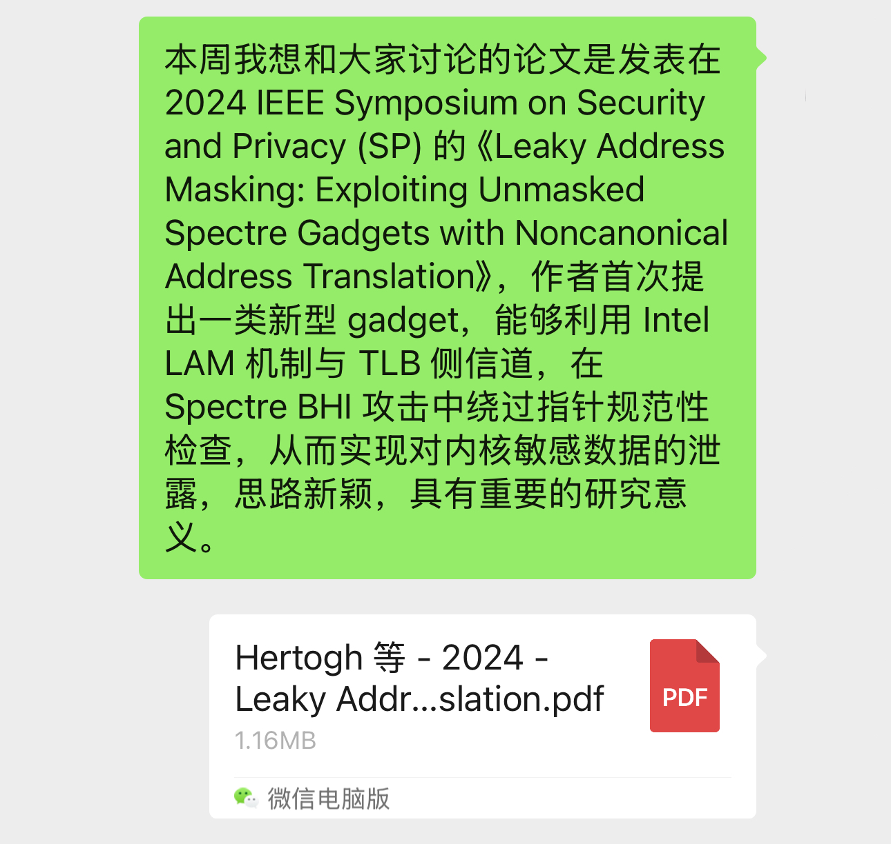

# 汇报流程
1. 汇报人进行讲解。
2. 听众就汇报内容提问，汇报人进行回答与讨论。

# 汇报要求
- 每人汇报时间 **15–20 分钟**。
- **材料提交（汇报当周周一至周三）**  
  请在汇报当周的 **周一至周三** 期间，将论文原文和一段简短介绍发送到「在读研究生」群。

> ### 简短介绍建议包含
> - 论文来源（会议/期刊、年份、作者/单位等）  
> - （可选）2–4 句内容概览：问题背景、核心方法、主要结论/贡献
>
> 示例：
>
> 
>
> - 清晰、精炼的介绍能显著提升听众兴趣，即使不打开论文，也能快速理解大意。
> 

# 关于汇报安排
- 如遇特殊情况无法按计划汇报，请**主动**与同学协商对调，或联系吴老师申请顺延。
- **所有排期变动以「在读研究生」群通知为准**，请及时关注群内相关消息。
- 若有任何变动，请**第一时间**联系 **崔佳奇**，便于同步更新排期。感谢配合！

# 温馨提示
- **深入浅出，讲“思想”而不只是“内容”**  
  从宏观（high-level）角度梳理问题与思路：为什么提出、核心点是什么、解决了什么、有哪些局限；尽量避免对原文细节的逐段复述。
- **每位听众至少提出 1 个问题**  
  可深可浅，重在参与讨论与共同思考。
- **把研讨会当成成长机会**  
  它是训练演讲、总结和表达的绝佳场合。即使发挥一般也不必气馁，我们会彼此支持、共同进步。

