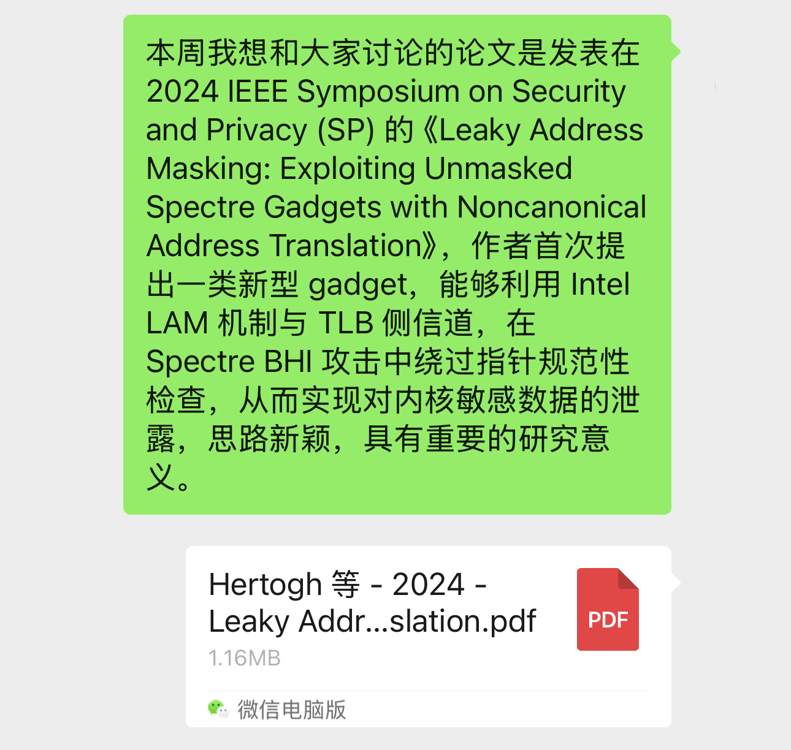

# 汇报流程
1. 汇报人进行讲解。
2. 听众就汇报内容提问，汇报人进行回答与讨论。

# 汇报要求
- 有效汇报时间需要控制在 **1 小时以内**。
- **[切记!]材料提交（汇报当周周一至周三）**  
  请在汇报当周的 **周一至周三** 期间，将论文原文和一段简短介绍发送到「在读研究生」群。
- **每位听众至少提出 1 个问题**  
  可深可浅，重在参与讨论与共同思考。

> ### 简短介绍建议包含
> - 论文来源（会议/期刊、年份、作者/单位等）  
> - （可选）2–4 句内容概览：问题背景、核心方法、主要结论/贡献
>
> 示例：
>
> 
>
> - 清晰、精炼的介绍能显著提升听众兴趣，即使不打开论文，也能快速理解大意。
> 
> 

# 论文分享指导
- **深入浅出，讲“思想”而不只是“内容”**  

  从宏观（high-level）角度梳理问题与思路：为什么提出、核心点是什么、解决了什么、有哪些局限；尽量避免对原文细节的逐段复述。

- **讲解前需要有必要基础知识的铺垫**

  听众来自不同研究的小组，只有在大致了解相关知识，才能理解演讲者的分享内容。否则，大量的时间与精力将会消耗在询问相关基础知识上，这将会降低论文研讨会的效率。

- **仔细思考论文中蕴含的技巧**

  一篇论文或许并不是深不可测、无懈可击的，它能被高水平会议\期刊录用，有很大程度上得益于其中的技巧（写作方式、话术手段、数据处理等）。如果我们能够体会到其中的技巧与策略，那么我们在未来的论文写作中就能有的放矢，将自己的想法以更好的方式表达出来。

- **把研讨会当成成长机会，而非棘手的任务**  

  论文研讨会是训练演讲、总结和表达的绝佳场合。即使发挥一般也不必气馁，我们会彼此支持、共同进步。

# 关于汇报安排
- 如遇特殊情况无法按计划汇报，请**主动**与同学协商对调，或联系吴老师申请顺延。

- **所有排期变动以「在读研究生」群通知为准**，请及时关注群内相关消息。

- 若有任何变动，请**第一时间**联系**崔佳奇**，便于同步更新排期。感谢配合！

# 线上会议室
- 论文研讨会具有固定的周期性腾讯会议，线上会议与线下同步进行
- [腾讯会议：607-8109-3800](https://meeting.tencent.com/dm/e7qJsATn74iE)

# 时间变动记录
- 2025-9-18 因特殊情况暂停一周，后续安排依次顺延
- 2025-12-31 新年跨年暂停一周，后续安排依次顺延
- 2026-3-18 2026春组内聚餐暂停一周，后续安排依次顺延